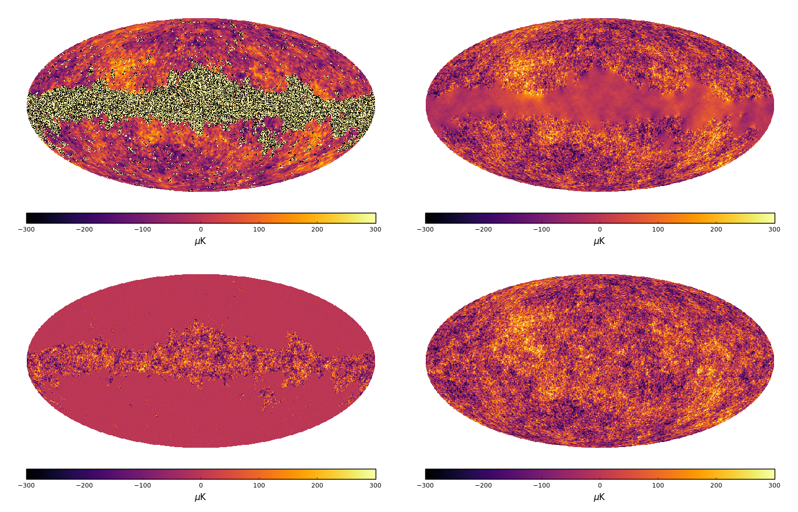
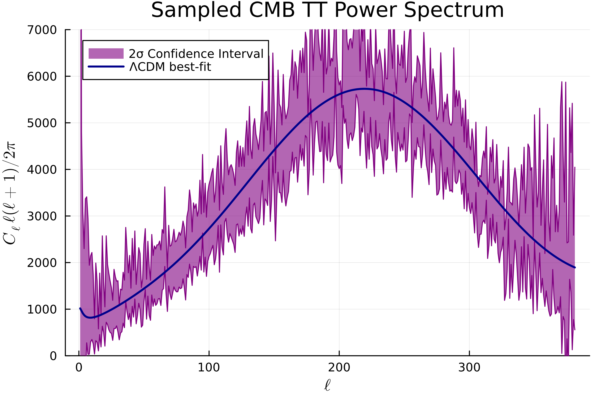

# Jommander

## A Parallel Julia Implementation of CMB Gibbs Sampling

Jommander exploits the package [HealpixMPI.jl](https://github.com/LeeoBianchi/HealpixMPI.jl) to implement a parallel, efficient and Julia-only Gibbs Sampling algorithm of CMB power spectrum.

The following figure shows how Jommander, through the sampling of its power spectrum, is able to infer and reconstruct a statistically consistent samples of the CMB map (bottom-right), starting from a noisy, smoothed and masked sky map (top-left).
The top-right panel shows the maximum-likelihood solution of the true CMB map, i.e. without the fluctuations (bottom-left panel) induced at each step of the chain.



<br/><br/>

This second plot shows the 2-σ confidence interval of 250 power spectrum samples produced by Jommander, compared to the true power spectrum measured by Planck.




## Some math

Mathematically, the algorithm works by drawing alternate samples from the following pair of equations in harmonic space:

````math
\begin{split}
\mathbf{\tilde{s}}^{(t+1)} & \sim P(\mathbf{\tilde{s}} | C_\ell^{(t)}, \mathbf{d}) \\
C_\ell^{(t+1)} & \sim P(C_\ell^{(t)}| \mathbf{\tilde{s}}^{(t+1)})
\end{split}
````

**Drawing a power spectrum** $C_\ell^{(t+1)}$ given a sky map $\mathbf{s}^{(t)}$ is quite trivial.
All we have to do is compute the power spectrum of the sky map's harmonic coefficients, as
````math
\begin{equation}
	\sigma_\ell = \sum_{m=-\ell}^{\ell} |\mathbf{\tilde{s}}_{\ell m}|^2,
\end{equation}
````
then draw $2 \ell - 1$ random Gaussian variates $\rho_\ell^j \sim \mathcal{N}(0,1)$ to compute the sum
````math
\begin{equation}
  \rho_\ell^2 = \sum_{j=1}^{2\ell - 1} |\rho_\ell^j|^2.
\end{equation}
````
The desired power spectrum sample is then given by
````math
\begin{equation}
  C_\ell^{(t+1)} = \frac{\sigma_\ell}{\rho_\ell^2}.
\end{equation}
````
Of course, this process must be done for each $\ell$ we want to include in the power spectrum.

On the other hand, **drawing a sky map** $\mathbf{\tilde s}^{(t+1)}$ given a power spectrum $C_\ell^{(t)}$ and the data $\mathbf{\tilde d}$ is definitely not trivial.
In fact, in order to obtain the desired sample of $\mathbf{\tilde s}$, Jommander solves, through a conjugate gradient method, the following equation:
````math
\begin{equation}
  \left(\mathbf{\tilde C}^{-1} + \mathbf{\tilde A}^\mathrm{T} \mathbf{Y}^\mathrm{T} \mathbf{N}^{-1} \mathbf{Y} \mathbf{\tilde A} \right) \mathbf{\tilde{s}} = \mathbf{\tilde A}^\mathrm{T} \mathbf{Y}^\mathrm{T} \mathbf{N}^{-1} \mathbf{d} + \mathbf{\tilde A}^\mathrm{T} \mathbf{Y}^\mathrm{T} \mathbf{N}^{-1/2} \omega_1 + \mathbf{\tilde C}^{-1} \tilde{\omega}_2.
\end{equation}
````
Where $\omega_1$ and $\tilde{\omega}_2$ are two Gaussian random vectors in pixel and harmonic space respectively.

In general, it is always convenient to deal with each element in the space where they are naturally diagonal.
For this reason, the noise covariance matrix will remain defined in the pixel space, and so does $\omega_1$.
The spherical harmonic transforms $\mathbf{Y}$ and $\mathbf{Y}^\mathrm{T}$ are applied to make everything consistent.

## Run an example

To run an example of CMB power spectrum sampling, starting from an observed simulated map with noise and incomplete sky coverage, use the script `PSchainMPI.jl` as:
````shell
$ mpiexec -n {Ntask} julia PSchainMPI.jl
````

The script `PSchainplot.jl` can then be used to produce plots of the obtained chain of power spectra.
